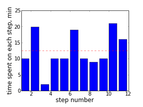

title: Bar Histogram
date: 2009-09-05
---
.. |--| unicode:: U+2013   .. en dash
.. |---| unicode:: U+2014  .. em dash, trimming surrounding whitespace
   :trim:

Sometimes a big task requires many small steps to be completed. When planning, I split it into such steps that are clear how to complete in short time intervals. Timing each step may bring good dynamics into work, and sometimes signals that a step should be further divided. I was curious to see a visual representation of actual time intervals to complete a recent sequence of such steps.

A simple bar histogram seemed sufficient to satisfy this curiosity. `Matplotlib <http://matplotlib.sourceforge.net/>`__ Python library was helpful as always. Some insight could be gained even from such a simple visualization. For instance, in that particular task, after some time, steps were taking longer (maybe it was a natural point to take a break? or may be a point to re-plan the further steps?).

The code of this example is available at `github <http://github.com/dudarev/datavis/blob/master/001_simple_bar/time_intervals.py>`__.
