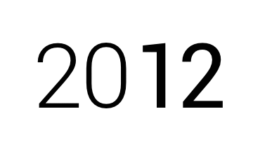

title: Animated Changing Year with Matplotlib
date: 2013-01-12
---

The `source code`_ for the image above is a good place to reference creation of animated GIFs with Matplotlib (PNG images created with Matplotlib are combined with Imagemagick_). It is also a good place to see how a custom font may be used, and how one may get a bounding box coordinates for text in Matplotlib.

.. _source code: https://github.com/dudarev/datavis/tree/master/010_animate_year
.. _imagemagick: http://www.imagemagick.org/script/index.php
